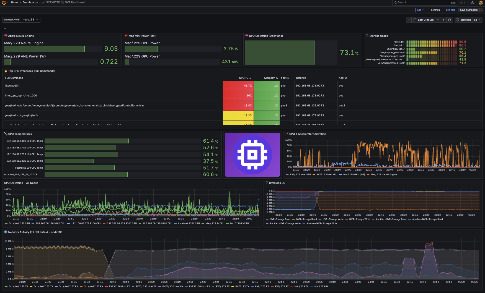
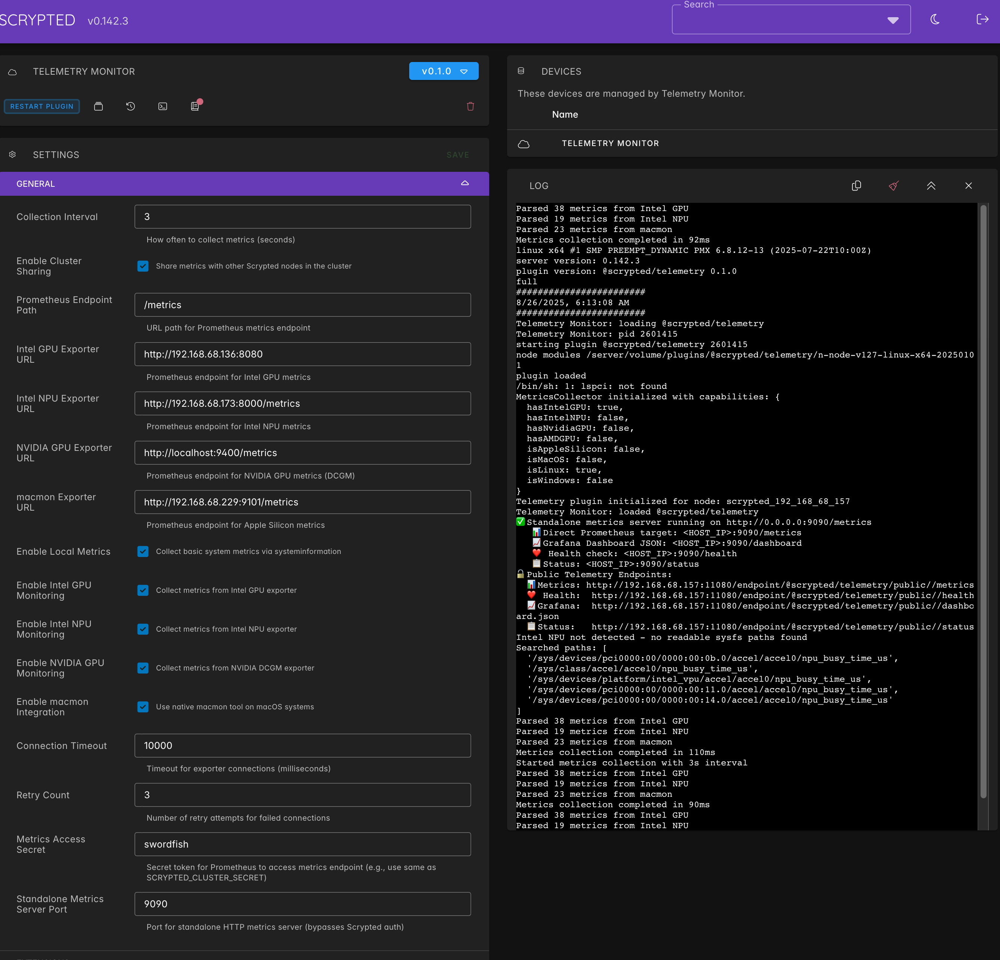

# Scrypted Telemetry Plugin

Hardware monitoring plugin for Scrypted. Collects CPU, GPU, NPU, memory, disk, and network metrics from multiple sources and provides Prometheus-compatible endpoints.

## What it does

- Monitors Intel GPU, Intel NPU, NVIDIA GPU, Apple Silicon metrics  
- Collects system metrics (CPU temp/usage, memory, disk, network)
- Provides Prometheus endpoints for Grafana dashboards
- Works across multiple Scrypted nodes with cluster sharing

## Required exporters

Install these first, then configure the plugin:

**Intel systems:**
- `andrewgolikov55/intel-gpu-exporter` (publicly available)
- `local/intel-npu-top` (build locally from provided Dockerfile)
- `local/intel-npu-prometheus-exporter` (build locally from provided Dockerfile)

**NVIDIA systems:**
- `nvcr.io/nvidia/k8s/dcgm-exporter:3.3.5-3.4.0-ubuntu22.04` (publicly available)

**macOS:**
- `local/macmon-prometheus-exporter` (build locally from provided Dockerfile)

**All systems:**
- `prom/node-exporter` (publicly available)
- Prometheus 
- Telegraf (optional, for enhanced system metrics)

**Note**: Images prefixed with `local/` must be built using the provided build scripts in the `deployments/` directory.

## Installation

1. Install required exporters for your hardware
2. Install this plugin in Scrypted
3. Configure exporter endpoints in plugin settings
4. Access metrics at `/endpoint/telemetry/metrics` or standalone server port

## Screenshots

Grafana dashboard with multi-node monitoring:


Scrypted plugin configuration:


## Docker deployments

Pre-configured docker-compose files in `/deployments/` for different hardware combinations.

**⚠️ Image Availability Notice**: Some Docker images referenced in deployment files need to be built locally as they are not published to public registries. See the [Deployment Guide](deployments/README.md) for details.

### Quick Start
```bash
# Build required local images first
cd deployments
./build-images.sh

# Then choose your deployment based on hardware
cd intel-full  # or nvidia, macos, etc.
docker-compose -f docker-compose-updated.yml up -d
```

For detailed deployment instructions and troubleshooting, see [deployments/README.md](deployments/README.md).

## Prometheus config example

```yaml
scrape_configs:
  - job_name: 'scrypted-telemetry'
    static_configs:
      - targets: ['scrypted-host:9090']
```

## Notes

This was fun to build but I can't scale it for everyone's setup. Take it, run with it, make it easier for users if you want.

Thanks to bjia56 for cosmotop inspiration and koush for Scrypted.